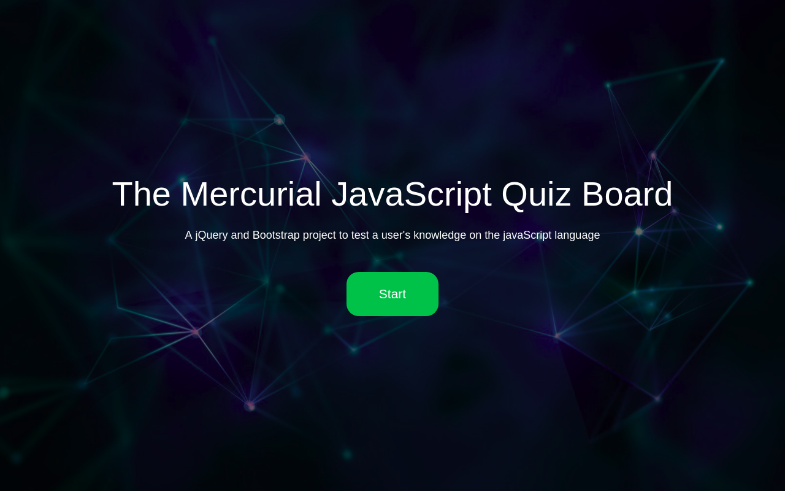
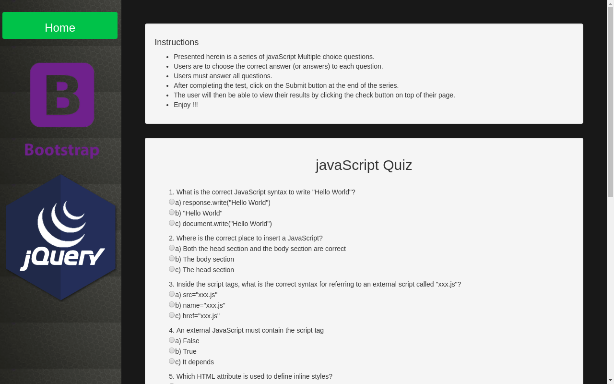
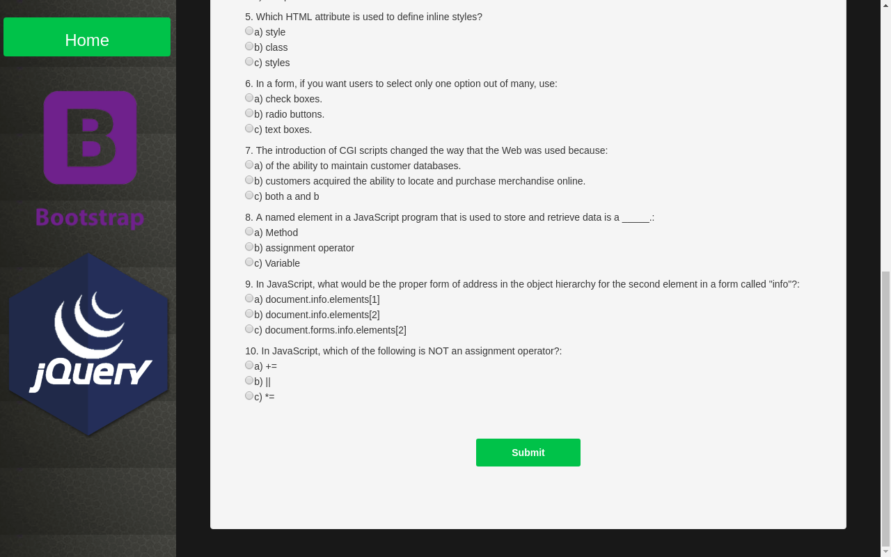
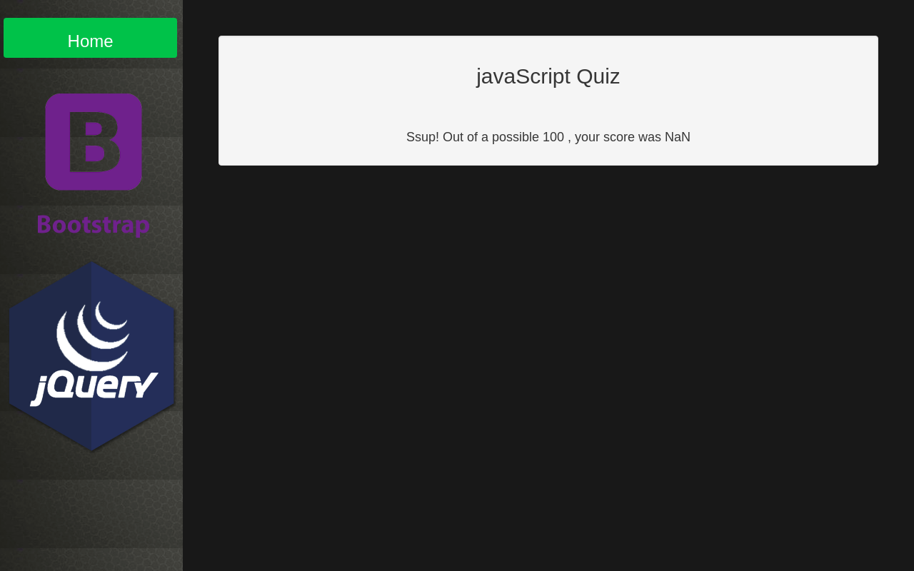

# The Mercurial JavaScript Quiz Board

## Project Description

This project enables a user to test their knowledge of javaScript. A user will be able to take a JS quiz and get their results to confirm if their understanding of the language is above novice-level. Users first leave their names and emails then proceed to take the test.The user submits their answers where a predefined code checks their correctness and grades the take. Afterwards, users can view their results of their take via a check button. Upon their will, users can get their results emailed to them if they provided an email.

## Deployment

To deploy the program, stage it on Git and push it to GitHub. Then, create a gh-pages branch from your master branch in the local machine. Thereafter, push the project to gh-pages on GitHub. After that, the program will be ready for Deployment on Git Hub Pages

The live page can be found in the following link: [The Mercurial JavaScript Quiz Board](https://mercurialmune.github.io/Triangle-Tracker/)

* After Deployment, the following image shows what the expected output would be.

## Behavior Driven Development
  As with any other reputable development project, the Mercurial JavaScript Quiz Board followed a systematic process between its conceptualization stage and its actual implementation. First, it was considered that users needed to perform certain tasks. However, due to the simplicity of the program, there wasn't much users could do with it. However, it was assumed that in the least, users should:

  * View the posted javaScript questions
  * Choose the correct answers among the multiple choices
  * Choose multiple answers where cases allow such an option
  * View their progress inconclusively navigating the series
  * Submit their answers
  * View their results after completion

  Considering these two desired behaviors, it was evident that the program should at least:

  1. Provide suitable answering methodologies such as option boxes and check-boxes
  2. Provide a status bar to show the progress of a quiz
  3. Provide a submit button to check the answers for correctness
  4. Provide a back-end code to mark the answers and grade the users
  5. Provide a means to display the results of an attempt
  6. Provide a means to toggle the visibility of the results

## Built With

* Atom - The text editor used
* Git - The version control environment Used
* Bootstrap

## Technologies and Frameworks Used

* HTML
* CSS
* javaScript
* Bootstrap
* jQuery

## Contributing

Any contributions to this projects will be greatly appreciated. If you want to contribute to it, here are the suggested instructions:
* Clone this GitHub repository to your local machine.
* Make your contributions.
* Email me the zipped project at munenecyp@gmail.com , or
* Request permissions to post your contribution at my GitHub repository through the same email address.

Alternatively, you could email the main developer at munenecyp@gmail.com with ideas on how this project could be more effective, efficient or beneficial.

## Versioning
Used GIT and GitHub. There are commits attached to the entire project to show the management of versions.

## Authors

 Cyprian Munene, any other contributor after the completion of the work can be viewed at this GitHub repository

## Copyright

All Rights Reserved by [@MercurialMune](https://github.com/MercurialMune)
Other GitHub can however fork or clone this repository provided the necessary credit is given to the original author
## License

This project is licensed under the MIT License. Moringa School moreover retains certain rights to elements in the code of this program.

## Acknowledgments

* Bootstrap documentation
* The good folks at [W3Schools](www.w3schools.com) for showing me the ropes where implementation of ideas eluded me
* Hat tip to anyone whose code was used
* Inspiration
* MORINGA TMs
